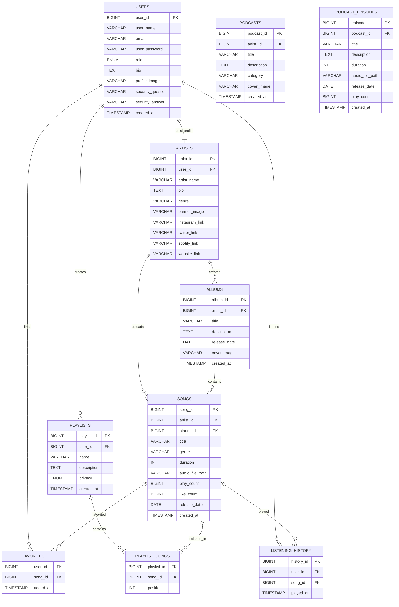
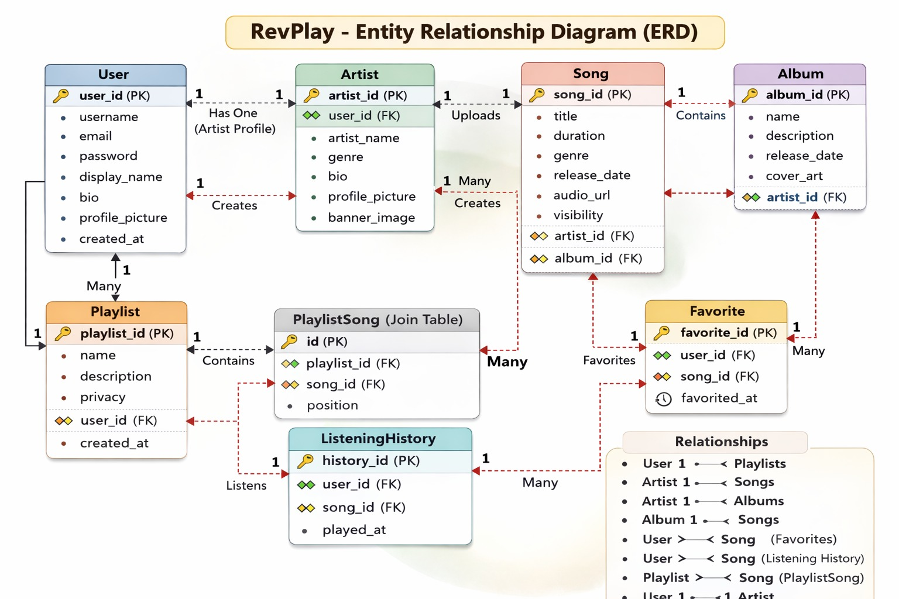
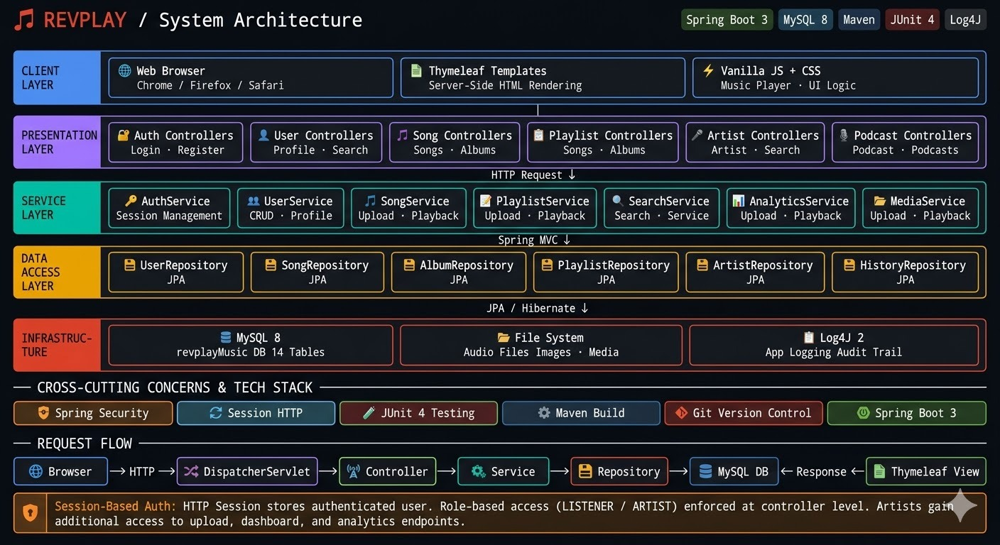

# 🎧 P2 – RevPlay

## 📌 Overview
RevPlayMusic is a full-stack monolithic music streaming web application. Users explore songs, artists, playlists, albums, and podcasts through a responsive web interface. Users search music, mark favorites, manage playlists, and play songs using an integrated web music player. Artists create profiles, upload music, manage albums, and track engagement analytics. The system supports role-based access, responsive UI, and scalable backend architecture.

## 🎯 Core Features

## 👤 Listener (User) Features

### Authentication & Profile
- 📝 Register account using email, username, and password
- 🔐 Secure login using email or username
- 👤 View and edit profile information
- 🖼️ Upload profile picture
- 📊 View personal account statistics

### Music Discovery
- 🔍 Search songs, artists, albums, and playlists
- 📂 Browse music by genre, artist, or album
- 🎧 Browse complete music library
- 📅 Filter songs by release year
- 📄 View song details including title, artist, album, genre, and duration
- 👨‍🎤 View artist profiles with songs and albums
- 💿 View album details with track list

### Music Player & Playback
- ▶️ Play songs using integrated web player
- ⏸️ Pause music playback
- ⏭️ Skip forward and backward
- ⏩ Seek through song timeline
- 📊 View progress bar of current song
- 📑 Manage playback queue
- 🔁 Enable repeat modes (off, repeat one, repeat all)
- 🔀 Enable shuffle playback
- 🔊 Adjust volume level

### Favorites & Collections
- ❤️ Mark songs as favorites
- ❌ Remove songs from favorites
- 📃 View favorite songs list
- ⚡ Quick access to favorites from music player

### Playlist Management
- 📀 Create playlists with name and description
- 🔐 Set playlist privacy (public or private)
- ➕ Add songs to playlists
- ➖ Remove songs from playlists
- 🔀 Reorder songs in playlists
- 📑 View all playlists
- ✏️ Update playlist details
- 🗑️ Delete playlists created by user
- 🌍 View public playlists
- ⭐ Follow or unfollow playlists

### Listening History
- 🕒 View recently played songs (last 50 tracks)
- 📊 View complete listening history with timestamps
- 🧹 Clear listening history

## 🎤 Artist Features
Artists include all listener features plus the following capabilities.

### Account
- 🧑‍🎤 Register as an artist
- 🔐 Login securely

### Artist Profile Management
- 📝 Create and manage artist profile
- 🎼 Update bio and genre
- 🖼️ Upload profile picture and banner image
- 🔗 Add social media links (Instagram, Twitter, Spotify, Website)
- 👀 Preview public artist profile

### Music Upload & Management
- 🎶 Upload songs with metadata
- 💿 Upload album artwork
- 📀 Create albums with description and release date
- ➕ Add songs to albums
- ➖ Remove songs from albums
- 📂 View uploaded songs and albums
- ✏️ Update song and album information
- 🗑️ Delete songs
- 🗑️ Delete albums when empty
- 🔓 Set song visibility (public or unlisted)

### Analytics & Insights
- 📊 Artist dashboard with key metrics
- 🎶 View total songs uploaded
- ▶️ Track play count for songs
- ❤️ View number of favorites
- 🔝 View most popular songs
- 📈 Analyze listening trends
- 👥 Identify top listeners

## 🔐 Standard Functional Scope
- Secure authentication system
- Role-based access control
- Music player integration
- File management for audio and images
- Data storage and retrieval
- Responsive user interface

## 🧑‍💻 Roles and Responsibilities
- Designed full-stack application architecture
- Implemented backend using Spring Boot
- Developed REST APIs for music and user management
- Implemented database schema and queries
- Integrated web music player functionality
- Implemented logging and error handling
- Performed unit testing
- Managed source code using Git

## 🛠️ Tech Stack
- ☕ Java
- 🌱 Spring Boot
- 🗄️ SQL Database
- 📦 Maven
- 🧪 JUnit4
- 🪵 Log4J
- 🌿 Git

---

# 📊 Database ER Diagram

The database schema models users, artists, songs, albums, playlists, podcasts, favorites, and listening history.

### ER Diagram

---

# 🏗️ Spring Boot Architecture

RevPlay follows a layered architecture using Spring Boot.

### Layers

Client Layer  
Web browser interface and music player.

Controller Layer  
Handles HTTP requests.

Examples:
- UserController
- SongController
- PlaylistController
- ArtistController

Service Layer  
Contains business logic.

Examples:
- UserService
- SongService
- PlaylistService
- ArtistService

Repository Layer  
Handles database operations.

Examples:
- UserRepository
- SongRepository
- PlaylistRepository
- AlbumRepository

Database Layer  
MySQL database storing all application data.

### Architecture Diagram

---

## 🚀 Key Highlights
- Full-stack music streaming platform
- Integrated web music player
- Role-based user and artist system
- Playlist and favorite management
- Artist analytics dashboard
- Scalable layered architecture

---
RevPlay = Revature + MusicPlayer 🎧🎶
